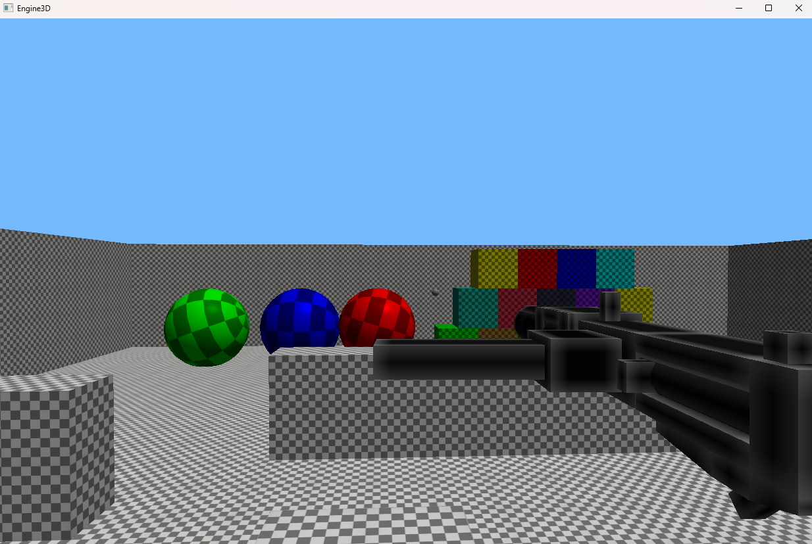
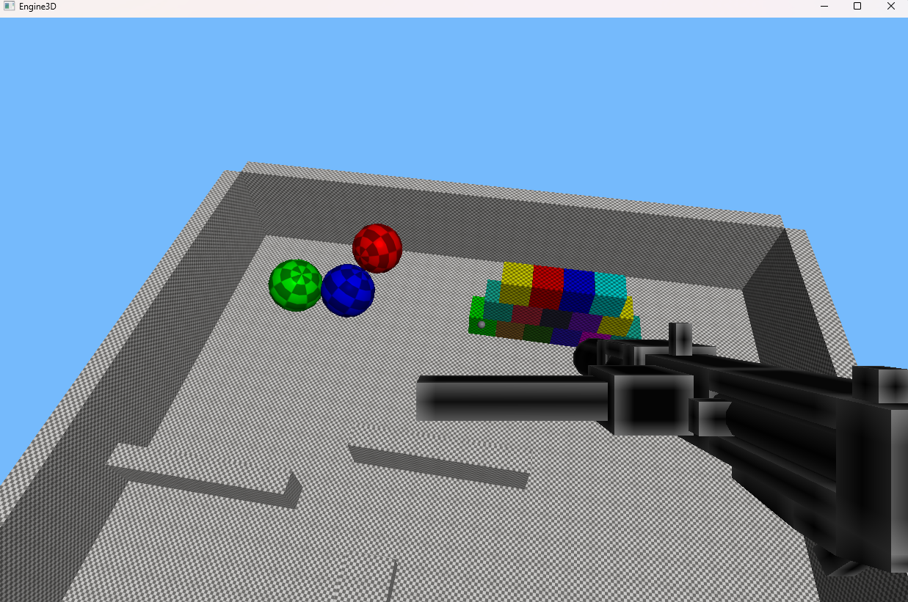
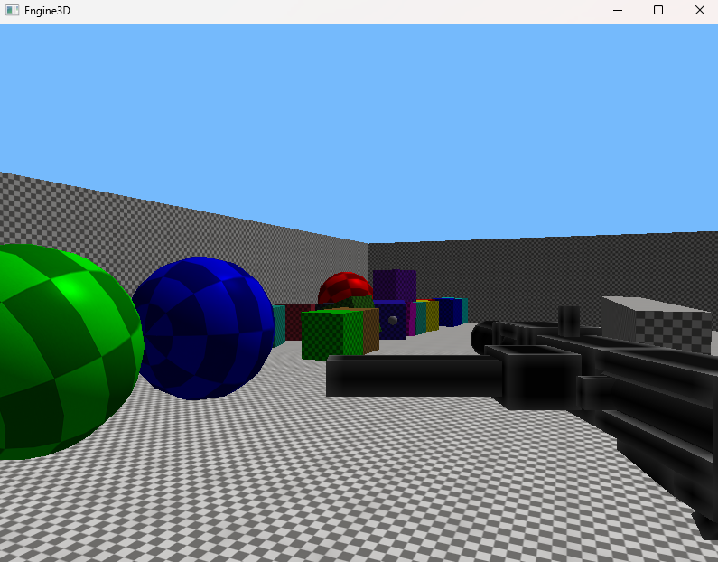

# 🎮 Custom Game Engine (C++ / OpenGL)

A custom-built **2D/3D game engine** developed from scratch in **C++** using **OpenGL**, created as a learning and portfolio project focused on real-world engine architecture and systems programming.

This project explores how modern game engines work under the hood, taking inspiration from engines like Unity and Unreal, but implemented at a low level for full control and understanding.

---

## ✨ Features

- Real-time **2D & 3D rendering** with OpenGL  
- **Shader & material system** with lighting support  
- **Scene management** and hierarchical GameObjects  
- **Component-based architecture**  
- **JSON-driven** scene and asset loading  
- **Physics** and **audio** system integration  
- **UI framework** (buttons, text, menus)  
- **Camera control** and input handling  
- **glTF model loading & animation**

---

## 🖼️ Demo

---

## 🧠 What This Project Demonstrates

- Modern **C++** (OOP, STL, engine-style architecture)
- Low-level **graphics programming** with OpenGL
- Engine subsystems design and integration
- Data-driven gameplay systems
- Clean, modular, and extensible code structure

---

## 🛠️ Requirements

- C++ (basic to intermediate level)
- OpenGL-capable GPU
- Visual Studio or CLion
- Basic understanding of 3D math (vectors, matrices)

---

## 📚 Background

Built after completing the **“Game Engine Development with C++ and OpenGL”** course (18.5h), progressing from an empty C++ project to a fully functional game engine capable of running a small 3D game prototype.

---

## 📄 License

MIT